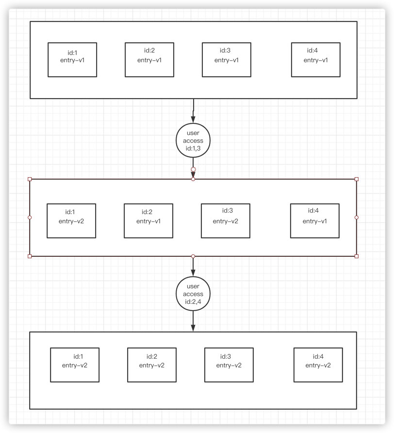

# gdcache

gdcache is a pure non-intrusive distributed cache library implemented by golang, you can use it to implement your own
distributed cache. [中文文档](https://github.com/ulovecode/gdcache/blob/main/README_CN.md)

## Core principle

The core principle of gdcache is to convert sql into id and cache them. Then each id is queried and cached. In this way, each sql can use the entity content corresponding to each id.

As shown in the figure above, each piece of sql can be converted to the corresponding sql, and the bottom layer will reuse these ids. If these ids are not queried, because we don’t know whether they are out of date or because these values do not exist in the database, we will all be in the database and access these entities that cannot be retrieved from the cache from the database. Get it once, and if it can get it, it will cache it once.

## Strategy for updating the cache

gdcache adopts a strategy of gradually updating the cache. When you access a key, we will determine whether the entry has a new update. If there is a new update, we will put the entity corresponding to id into a new value.

As shown in the above figure, each entry will have a version number. Whenever we know that this entry is updated and accessed by the user, we will update the cache until the entire entry is replaced.

## Save memory

The conventional caching framework will cache the content of the result, but the gdcache cache library is different from it. It will only cache the id of the result and find the value through the id. The advantage of this is that the value can be reused, and the value corresponding to id will only be cached once.
