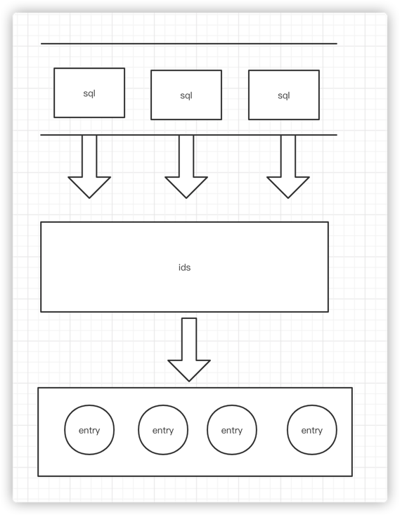

<!-- START doctoc generated TOC please keep comment here to allow auto update -->
<!-- DON'T EDIT THIS SECTION, INSTEAD RE-RUN doctoc TO UPDATE -->

- [gdcache](#gdcache)
  - [特性](#%E7%89%B9%E6%80%A7)
  - [核心原理](#%E6%A0%B8%E5%BF%83%E5%8E%9F%E7%90%86)
  - [节省内存](#%E8%8A%82%E7%9C%81%E5%86%85%E5%AD%98)
  - [安装](#%E5%AE%89%E8%A3%85)
  - [快速开始](#%E5%BF%AB%E9%80%9F%E5%BC%80%E5%A7%8B)
    - [gorm 使用](#gorm-%E4%BD%BF%E7%94%A8)
    - [xorm 使用](#xorm-%E4%BD%BF%E7%94%A8)
    - [原生SQL 使用](#%E5%8E%9F%E7%94%9Fsql-%E4%BD%BF%E7%94%A8)
  - [如何使用](#%E5%A6%82%E4%BD%95%E4%BD%BF%E7%94%A8)
  - [贡献](#%E8%B4%A1%E7%8C%AE)
  - [许可证](#%E8%AE%B8%E5%8F%AF%E8%AF%81)

<!-- END doctoc generated TOC please keep comment here to allow auto update -->

# gdcache

gdcache 是一个由 golang 实现的纯非侵入式缓存库，你可以用它来实现你自己的缓存。 [英文文档](https://github.com/ulovecode/gdcache/blob/main/README.md)

[](https://goreportcard.com/report/github.com/ulovecode/gdcache)
[](https://pkg.go.dev/github.com/ulovecode/gdcache)
[](https://codecov.io/gh/ulovecode/gdcache)

## 特性

- 自动缓存 sql
- 复用 sql 之间的缓存
- 适配 Xorm 和 Gorm 框架
- 支持缓存联合key  
- 轻量级
- 无侵入性
- 高性能
- 灵活的

## 核心原理

gdcache 的核心原理是将 sql 转换成 id 缓存起来 , 并缓存 id 对应的实体。这样每个 sql 有相同的 id 可以复用对应的实体内容了。



如上图所示，每一段sql都可以转换为对应的sql，底层去复用这些id。如果这些这些id没有被查询到，由于我们不知道到底是因为过期了，还是因为这些值在数据库中不存在，我们都会在数据库中，将这些无法从cache中取的实体从从数据库中再访问一遍获取，如果能够获取到，会进行一次缓存。

## 节省内存

常规的缓存框架，会缓存结果的内容，但 gdcache 缓存库与之不同，他只会缓存结果的id，并通过id去寻找值。这样的好处是，可以重复利用值，id 对应的值只会被缓存一次。

## 安装

```shell
go get github.com/ulovecode/gdcache
```

## 快速开始

- 要被缓存的类必须要实现 `TableName()` 方法，并且使用  `cache:"id"`  来标明被缓存的key，默认是通过 `id` 来进行缓存，并且 `cache` 标签的值对应数据库中的字段，通常情况可以忽略。

```go
type User struct {
	Id   uint64 `cache:"id"` // Or omit the tag
	Name string 
	Age  int
}

func (u User) TableName() string {
	return "user"
}
```

- 如果要是使用联合key，可以为多个字段添加 `cache` 标签

```go
type PublicRelations struct {
	RelatedId uint64 `cache:"related_id"`
	RelatedType string  
	SourceId uint64 `cache:"source_id"`
	SourceType string 
}

func (u PublicRelations) TableName() string {
	return "public_relations"
}
```

- 实现 `ICache` 接口，可以使用redis或者gocache作为底层实现。

```go
type MemoryCacheHandler struct {
	data map[string][]byte
}

func (m MemoryCacheHandler) StoreAll(keyValues ...gdcache.KeyValue) (err error) {
	for _, keyValue := range keyValues {
		m.data[keyValue.Key] = keyValue.Value
	}
	return nil
}

func (m MemoryCacheHandler) Get(key string) (data []byte, has bool, err error) {
	bytes, has := m.data[key]
	return bytes, has, nil
}

func (m MemoryCacheHandler) GetAll(keys schemas.PK) (data []gdcache.ReturnKeyValue, err error) {
	returnKeyValues := make([]gdcache.ReturnKeyValue, 0)
	for _, key := range keys {
		bytes, has := m.data[key]
		returnKeyValues = append(returnKeyValues, gdcache.ReturnKeyValue{
			KeyValue: gdcache.KeyValue{
				Key:   key,
				Value: bytes,
			},
			Has: has,
		})
	}
	return returnKeyValues, nil
}

func (m MemoryCacheHandler) DeleteAll(keys schemas.PK) error {
	for _, k := range keys {
		delete(m.data, k)
	}
	return nil
}

func NewMemoryCacheHandler() *MemoryCacheHandler {
	return &MemoryCacheHandler{
		data: make(map[string][]byte, 0),
	}
}
```

### gorm 使用

实现 `IDB` 接口

```go
type GormDB struct {
	db *gorm.DB
}

func (g GormDB) GetEntries(entries interface{}, sql string) error {
	tx := g.db.Raw(sql).Find(entries)
	return tx.Error
}

func (g GormDB) GetEntry(entry interface{}, sql string) (bool, error) {
    tx := g.db.Raw(sql).Take(entry)
    if gorm.ErrRecordNotFound == tx.Error {
    	return false, nil
    }
    return tx.Error != gorm.ErrRecordNotFound, tx.Error
}

func NewGormCacheHandler() *gdcache.CacheHandler {
	return gdcache.NewCacheHandler(NewMemoryCacheHandler(), NewGormDd())
}

func NewGormDd() gdcache.IDB {
	db, err := gorm.Open(mysql.Open("root:root@tcp(127.0.0.1:3306)/test?charset=utf8&parseTime=True&loc=Local"), &gorm.Config{})
	if err != nil {
		panic(err)
	}
	return GormDB{
		db: db,
	}
}
```

### xorm 使用

实现 `IDB` 接口

```go
type XormDB struct {
	db *xorm.Engine
}

func (g XormDB) GetEntries(entries interface{}, sql string) ( error) {
	err := g.db.SQL(sql).Find(entries)
	return  err
}

func (g XormDB) GetEntry(entry interface{}, sql string) ( bool, error) {
	has, err := g.db.SQL(sql).Get(entry)
	return has, err
}

func NewXormCacheHandler() *gdcache.CacheHandler {
	return gdcache.NewCacheHandler(NewMemoryCacheHandler(), NewXormDd())
}

func NewXormDd() gdcache.IDB {
	db, err := xorm.NewEngine("mysql", "root:root@/test?charset=utf8")
	if err != nil {
		panic(err)
	}
	return XormDB{
		db: db,
	}
}
```
### 原生SQL 使用

实现 `IDB` 接口

```go

type MemoryDb struct {
}

func NewMemoryDb() *MemoryDb {
	return &MemoryDb{}
}

func (m MemoryDb) GetEntries(entries interface{}, sql string) error {
	mockEntries := make([]MockEntry, 0)
	mockEntries = append(mockEntries, MockEntry{
		RelateId:   1,
		SourceId:   2,
		PropertyId: 3,
	})
	marshal, _ := json.Marshal(mockEntries)
	json.Unmarshal(marshal, entries)
	return nil
}

func (m MemoryDb) GetEntry(entry interface{}, sql string) (bool, error) {
	mockEntry := &MockEntry{
		RelateId:   1,
		SourceId:   2,
		PropertyId: 3,
	}
	marshal, _ := json.Marshal(mockEntry)
	json.Unmarshal(marshal, entry)
	return true, nil
}

func NewMemoryCache() *gdcache.CacheHandler {
	return gdcache.NewCacheHandler(NewMemoryCacheHandler(), NewMemoryDb())
}
```

## 如何使用

查询单个实体的时候通过实体的 id 查询，并填充到实体中,获取多个实体的时候，可以通过任意的 sql 查询，并最终填充到实体中。两个方法必须传入实体的指针。

```go
func TestNewGormCache(t *testing.T) {

	handler := NewGormCacheHandler()

	user := User{
		Id: 1,
	}
	has, err := handler.GetEntry(&user)
	if err != nil {
		t.FailNow()
	}
	if has {
		t.Logf("%v", user)
	}

	users := make([]User, 0)
	err = handler.GetEntries(&users, "SELECT * FROM user WHERE name = '33'")
	if err != nil {
		t.FailNow()
	}
	for _, user := range users {
		t.Logf("%v", user)
	}

	err = handler.GetEntries(&users, "SELECT * FROM user WHERE id in (3)")
	if err != nil {
		t.FailNow()
	}
	for _, user := range users {
		t.Logf("%v", user)
	}
	
        count, err = handler.GetEntriesAndCount(&users1, "SELECT * FROM user WHERE id in (1,2)")
        if err != nil {
        t.FailNow()
        }
        for _, user := range users1 {
        t.Logf("%v", user)
        }
        t.Log(count)
}
```

支持占位符`?`,替换数组和基本类型

## 贡献

您可以帮助提供更好的 gdcahe ，通过提交 pr 的方式。

## 许可证
© Jovanzhu, 2021~time.Now

发布在 [MIT License](https://github.com/ulovecode/gdcache/blob/main/LICENSE) 之下
