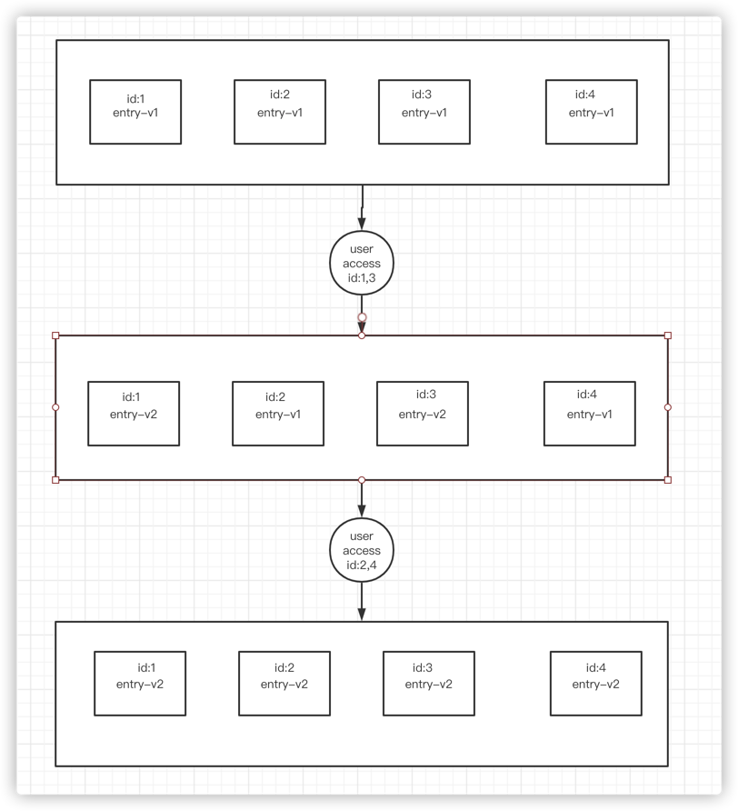

# gdcache

gdcache 是一个由 golang 实现的纯非侵入式分布式缓存库，你可以用它来实现你自己的 分布式缓存。 [英文文档](https://github.com/ulovecode/gdcache/blob/main/README.md)

## 核心原理

gdcache 的核心原理是将 sql 转换成 id 并缓存起来。然后查询并缓存每个 id 。这样每个 sql 就可以使用每个 id 对应的实体内容了。

如上图所示，每一段sql都可以转换为对应的sql，底层去复用这些id。如果这些这些id没有被查询到，由于我们不知道到底是因为过期了，还是因为这些值在数据库中不存在，我们都会在数据库中，将这些无法从cache中取的实体从从数据库中再访问一遍获取，如果能够获取到，会进行一次缓存。

## 缓存更新策略

gdcache 采用逐步更新缓存的策略，当你访问一个 key 的时候我们会判断这个 entry 是否有新的更新。如果有新的更新，我们会将 id 对应的实体放入一个新的 value。

如上图所示，每一个 entry 都会有一个版本号，每当我们知道这个 entry 存在更新，并且被用户访问到时，我们会更新这个缓存，直到替换到整个entry。
